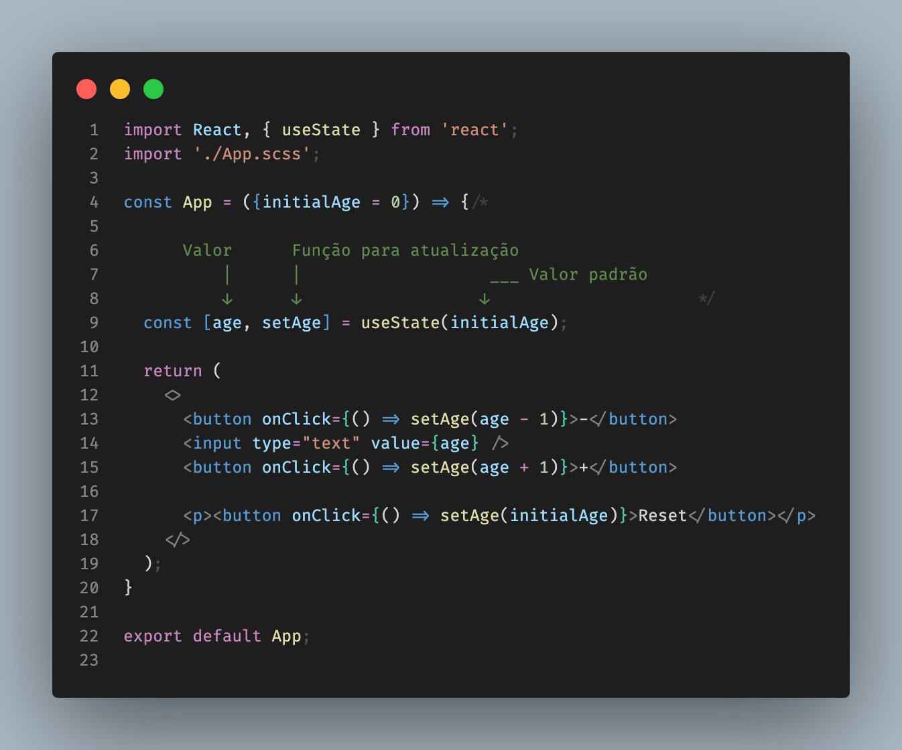

# useState() - React hooks

 

  Hooks é uma adição ao React 16.8. Eles permitem que você use o state e outros recursos do React sem 
  escrever uma classe. Interessante e sem precisar reescrever toda aplicação pois é 100% retrocompatíveis.

 

  Vamos falar do useState que te retorna um valor e uma função para atualização, podendo ele conter um valor 
  inicial. Abaixo podemos ver um exemplo simples da utilização.

 

  

   

Hooks veio para simplificar

O uso é bem simples, o exemplo mostra a facilidade do uso, ficando o código mais limpo e fácil de testar. A mesma funcionalidade usando classe torna o código mais verboso.

[Repositório](https://github.com/orivelton/use-state)
 
 
 
